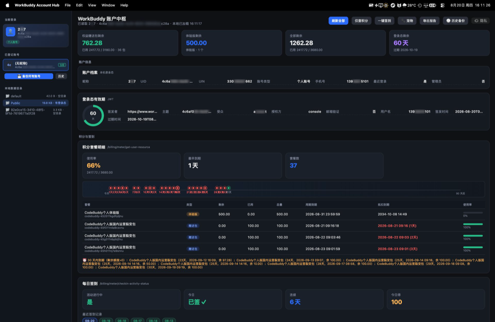
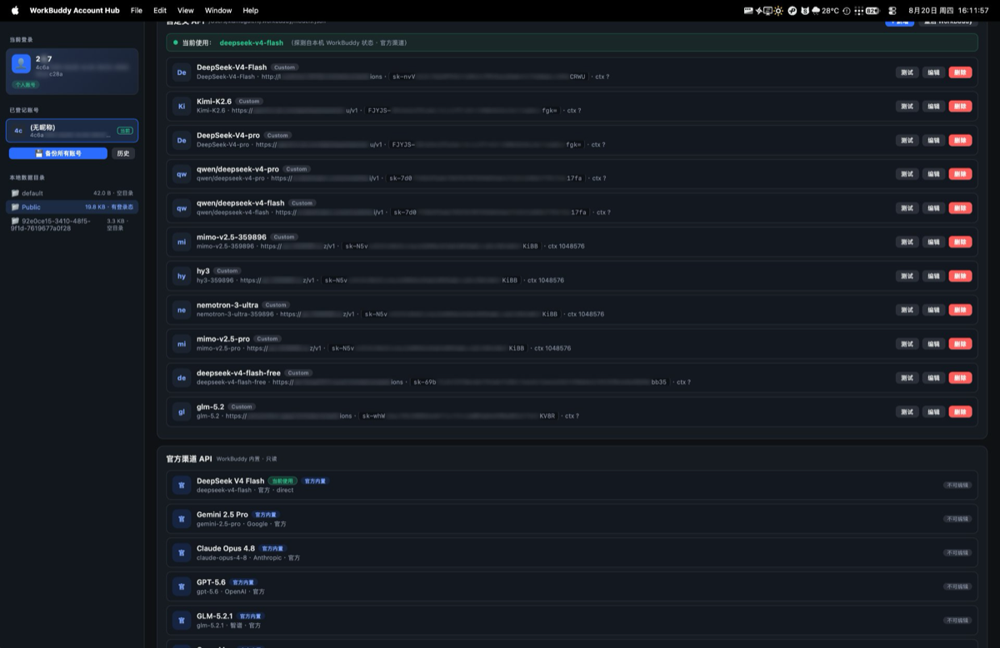
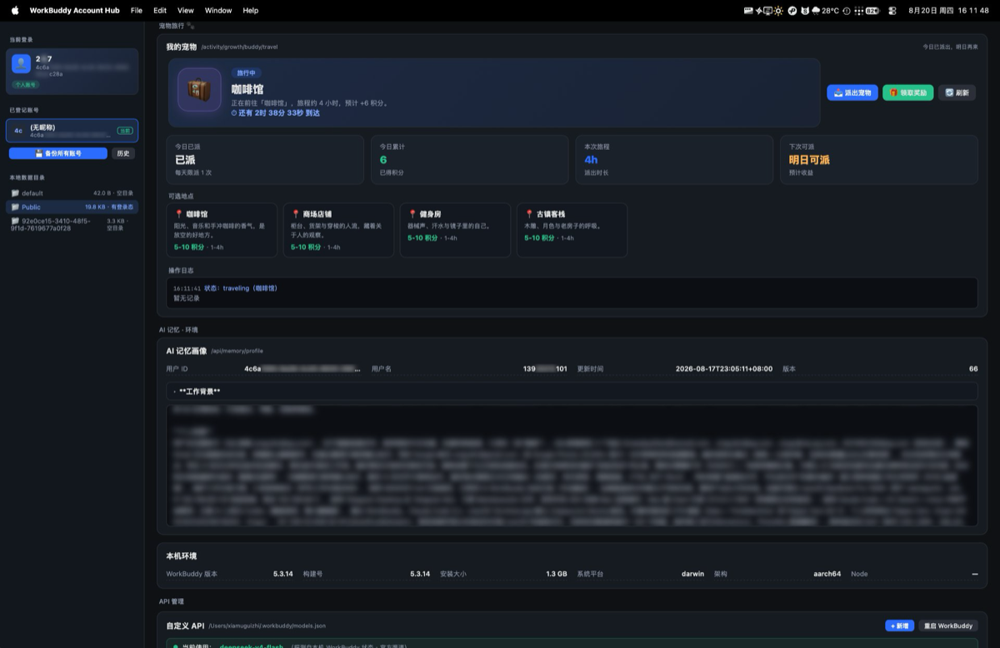

# WorkBuddy 账户中枢

> 🌟 **最大亮点：秒切账号，对话历史 100% 不丢。** 本机装了 100 个 WorkBuddy 账号？一键在它们之间切换，每个账号的**全部对话历史原样保留**——切到第 100 个再切回第 1 个，第 1 个的会话一条不丢。底层原理见下方 [实现原理](#实现原理为什么切换账号对话历史不丢)。

> 一个**本地运行**的跨平台（macOS / Windows）桌面端应用，把 WorkBuddy 账户的日常运维集中到一个窗口：
> **极速多账号切换、积分可视化、每日签到、宠物自动探险、登录态管理、AI 记忆画像、API 模型管理（含全局隐私中段模糊）**。
> 基于 Tauri 2 + Rust 实现，纯本地数据流，没有云端依赖。

[](https://github.com/xmgzxmgz/workbuddy-account-hub)
[](https://tauri.app/)
[](https://www.rust-lang.org/)
[](LICENSE)

> ⚠️ **安全声明**：本应用只读取你本机 WorkBuddy 客户端已保存的登录态（`~/Library/Application Support/CodeBuddyExtension/Data/Public/auth/workbuddy-desktop.info`），
> 不会向你索取账号密码，也不会把任何凭证上传到除官方接口以外的第三方。
> **请只在自己信任的机器上运行，并不要把包含登录态的文件提交到任何仓库。**

---

## 🌟 核心优势：为什么这是本项目最大的优点

**一句话：在多账号之间切换，你的对话历史永远不会丢。**

很多人同时用多个 WorkBuddy 账号（工作号 / 小号 / 测试号），但官方客户端一次只能登一个，切来切去最怕的就是「之前的对话不见了」。WorkBuddy 账户中枢从架构层面解决了这件事：

- ⚡ **秒级切换**：侧边栏列出本机所有登录过的账号（含从未手动备份过的），点一下即切换，自动重启 WorkBuddy 生效。
- 💾 **对话历史 100% 保留**：切换只换「登录身份」，不动「会话仓库」。每个账号的对话按 uid 隔离存在本机共享目录，切到 B 账号时 A 的会话原封不动，切回 A 立刻可见。
- 🛡 **自动兜底备份**：每次切换前，中枢会把「即将离开的账号」整份会话自动备份进本地保险库，极端情况也能一键还原。
- 🔁 **任意往返**：可切换账号列表只增不减，100 个账号随便切、随便回，没有「切出去就回不来」。

想知道底层是怎么做到的？看下面的 [实现原理](#实现原理为什么切换账号对话历史不丢)。

---

## ✨ 功能一览

| 模块 | 能力 | 状态 |
| --- | --- | --- |
| **🌟 极速多账号切换** | 列出本机所有登录过的账号，一键切换且**对话历史 100% 保留**（共享会话仓库 + 仅换登录态） | ✅ 稳定 |
| 概览卡片 | 权益赠送包剩余 / 体验版剩余 / 全部剩余 / 登录态剩余天数 | ✅ 稳定 |
| 账户档案 | 昵称、UID、UIN、账号类型、手机号、最近登录、管理员 | ✅ 稳定 |
| 登录态有效期 | 解析 JWT，签发者 / 过期时间 / 剩余天数（圆环进度） | ✅ 稳定 |
| 积分套餐明细 | 官方 `get-user-resource` 完整解析，到期时间轴（30 天内红色预警） | ✅ 稳定 |
| **每日签到** | 官方签到接口，连续天数 / 最近记录，一键签到领积分 | ✅ 稳定 |
| **宠物自动探险** | 派出宠物 → 显示派出状态/地点 → 归来自动领取积分，日志可见 | ✅ 新增 |
| AI 记忆画像 | 按 `## 标题` 折叠展示，整段隐私默认高斯模糊 | ✅ 稳定 |
| 本机环境 | 客户端版本、构建号、安装大小、平台 / 架构 | ✅ 稳定 |
| API 模型管理 | 自定义 key 增删改测 / 官方渠道 / 当前使用探测 / 重启生效 | ✅ 稳定 |
| **软件内添加账号** | 侧边栏「＋ 添加」直接在中枢里登记 WorkBuddy 账号；填 accessToken 可立即可切换 | ✅ 新增 |
| **全局隐私小眼睛** | 顶栏 👁 一键控制所有隐私字段（Key/UID/手机号/昵称/JWT/记忆画像/模型地址）中段模糊 | ✅ 稳定 |

> 💡 **宠物自动探险**是本版新增亮点：复用 WorkBuddy「成长中心」的宠物旅行玩法，
> 在桌面端可视化展示宠物状态（在窝休息 🏠 / 正在前往某地 / 已到达可领奖），
> 归来后**自动领取积分**，并记录完整旅行日志。每天限派 1 次，旅行通常 1~4 小时。

---

## 预览

**主仪表盘**（积分 / 套餐到期 / 登录态有效期 / 记忆画像）



**API 管理面板**（自定义 / 官方渠道 / 当前使用 + 全局隐私小眼睛）



**宠物自动探险面板**（派出状态 / 地点 / 倒计时 / 日志）



---

## 📦 安装

macOS 需要 Xcode Command Line Tools（`xcode-select --install`）；Windows 需要 [WebView2 Runtime](https://developer.microsoft.com/microsoft-edge/webview2/)（通常已预装）。

### 直接下载（推荐）

从 [Releases](https://github.com/xmgzxmgz/workbuddy-account-hub/releases) 下载最新版：
- **macOS**：`WorkBuddy.Account.Hub_<版本>_aarch64.dmg` / `.app.tar.gz`
- **Windows**：`WorkBuddy.Account.Hub_<版本>_x64-setup.exe` / `.msi`

双击挂载 / 运行安装器即可。

### 从源码构建

```bash
# 1. 克隆
git clone https://github.com/xmgzxmgz/workbuddy-account-hub.git
cd workbuddy-account-hub

# 2. 安装前端依赖（仅用于 tauri build）
cd tauri-app
npm install

# 3. 打包（首次下载 Rust crate 并编译，macOS / Windows 通用）
npx tauri build
# 产物：tauri-app/src-tauri/target/release/bundle/...
#   macOS → bundle/macos/*.app / *.dmg；Windows → bundle/nsis/*.exe / *.msi

# 4. 安装
#   macOS：
cp -R "tauri-app/src-tauri/target/release/bundle/macos/WorkBuddy Account Hub.app" /Applications/
open "/Applications/WorkBuddy Account Hub.app"
#   Windows：运行生成的安装器
#   .\tauri-app\src-tauri\target\release\bundle\nsis\*.exe
```

---

## 🚀 快速上手

### 日常流程
1. 打开 App → 顶部「刷新全部」自动读本机登录态 + 拉取全部数据
2. 「仅查积分」/「一键签到」按需触发单独请求
3. 「导出报告」生成可粘贴的 Markdown 快照，方便备份与排错

### 宠物自动探险
1. 打开「宠物」面板，看到当前状态：在窝休息 / 正在前往 / 已到达
2. 地点列表（咖啡馆等）**点击即可派出**宠物 → 倒计时显示归来时间
3. 归来后**自动领取积分**，奖励写入面板 + 日志自动记录派发/归来/领取全过程
4. 面板内置**自动轮询**（每 30 秒），无需手动刷新

### API 模型管理
1. 在「自定义 API」区管理 `~/.workbuddy/models.json`：新增 / 编辑 / 删除 / 一键测试连接
2. 改完点顶部「重启 WorkBuddy」让配置生效
3. 当前主程序正在使用哪个模型由顶栏探测条实时显示

### 软件内添加账号
1. 侧边栏「已登记账号」右上角点 **＋ 添加**
2. 填 **账号 UID**（必填，唯一标识）；昵称可选
3. **accessToken 可选**：
   - 留空 → 仅登记到列表，切换前需先在 WorkBuddy 登录该账号
   - 填写 → 立即生成可切换快照，**无需再登录即可一键切换**（token 通常取自另一台已登录设备的 `workbuddy-desktop.info` 里该账号条目）
4. 添加后侧边栏立刻出现该账号；带 token 的账号会显示「切换」按钮，可直接切过去

> ⚠️ 添加账号只写本机 `workbuddy-desktop.info` 的 `allAccounts`，不会向任何第三方上传凭证；
> 不带 token 的账号若要真正使用，仍需在 WorkBuddy 客户端完成一次登录。

### 全局隐私眼睛
- 默认状态：所有隐私字段**只露首尾 + 中段高斯模糊**
- 点顶栏 👁 隐私 → 全部清晰（图标变 🙈），再点 → 恢复模糊

---

## 🔨 从源码构建（开发 / 二次开发）

> 本仓库为 Tauri 2 桌面应用，修改 Rust 或前端后需重新构建才能生效。

###  prerequisites
- Rust 工具链：`rustup` + `cargo`（<https://rustup.rs>）
- Node.js ≥ 18（仅前端依赖）
- Windows：系统 WebView2（通常已自带）；macOS：Xcode Command Line Tools

### 构建 / 运行
```bash
cd tauri-app
npm install            # 安装前端依赖（如需）
npm run tauri dev      # 开发模式（热重载前端，Rust 改动自动重编）
# 或打出安装包 / 便携版
npm run tauri build
```

### 本次新增的「添加账号」涉及改动
- `src-tauri/crates/account_ops/src/lib.rs`：新增 `add_account()`（合并写入 `allAccounts` + 可选生成 vault 快照）
- `src-tauri/src/main.rs`：新增 `add_account` Tauri 命令并注册
- `src/index.html` + `src/main.js`：侧边栏「＋ 添加」按钮 + 添加账号弹窗 + 前端调用


## 🔧 实现原理：为什么切换账号对话历史不丢

很多「多账号切换」工具的实现是「整体覆盖用户数据目录」——切到 B 就把 A 的数据目录换掉，于是 A 的对话就丢了。本项目的做法正好相反，核心只有一句话：

> **切换账号 = 只换登录态文件，绝不碰会话仓库。**

下面逐层拆解：

### 1. WorkBuddy 的会话存在哪里，怎么和账号绑定

WorkBuddy 把每个账号的对话历史存在本机一个**共享目录**里（macOS：`~/.workbuddy/local_storage`；Windows：`%LOCALAPPDATA%\.workbuddy\local_storage`）。
关键在于：**每条会话都带有自己的账号 uid**。也就是说，这一个共享目录里同时躺着多个账号的对话，但彼此按 uid 严格隔离——WorkBuddy 只会显示「当前登录账号」名下的会话。

### 2. 中枢切换时到底改了什么

切换命令 `switch_account` 只做一件事：重写本机登录态文件 `workbuddy-desktop.info` 里的 `account` / `allAccounts` 字段，把「当前账号」指向你要切过去的那一个（带上它自己的 token）。

它**完全不读写 `local_storage`**——那个装着你全部对话的共享仓库从头到尾原样保留。

于是：
- 切到 B 账号 → 登录态变成 B，WorkBuddy 启动时只展示 B 名下的对话；A 的对话静静躺在共享目录里，一行没动。
- 切回 A 账号 → 登录态变回 A，A 的对话立刻全部回来。

这就是「切 100 次也不丢」的根本原因：**会话数据从来没被移动、覆盖或删除过，只是「当前视角」在账号之间平移。**

### 3. 切走之前先自动备份（兜底）

为了防住极端情况（比如某版 WorkBuddy 启动时对目录做了重写），中枢在每次切换前，会先把「即将离开的账号」整份 `local_storage` 自动备份进本地保险库 `vault/<uid>/history/<时间戳>/`。
切不回来？从历史备份里还原即可，对话零损失。

### 4. 可切换账号列表「只增不减」

切换时，`allAccounts` 用的是**合并**而非覆盖：把目标账号并回本机已登记账号列表。所以你切来切去，能切的账号越来越多，永远不会出现「切出去就回不来」。

### 5. 没备份过的账号也能一键切（按需快照）

老版本要求目标账号必须「先手动快照过」才能切，否则报错。现在中枢会在 `allAccounts` 里找到该账号时，**即时生成一份快照**（用共享 `local_storage` + 它的登录态条目），所以**任何在本机登录过的账号都能直接一键切换**，不必先逐个手动备份。

### 小结

| 维度 | 常见多账号工具 | 本账户中枢 |
| --- | --- | --- |
| 切换时是否动会话数据 | 整体覆盖 → 易丢 | 只换登录态 → 不动 |
| 切回原账号 | 可能丢失历史 | 历史原样保留 |
| 100 个账号 | 容易串台 / 丢失 | 按 uid 隔离，随便切随便回 |
| 兜底 | 无 | 每次切换前自动备份 |

**结论**：无论你本机有 2 个还是 100 个账号，切换只平移「当前身份」，会话仓库始终不动——这也正是本项目最值得拿出去讲的核心能力。

---

## 📡 接口说明

本应用仅调用 WorkBuddy **官方接口**（`copilot.tencent.com`），不连任何第三方服务。

| 用途 | 方法 | 路径 |
| --- | --- | --- |
| 积分套餐 | POST | `/v2/billing/meter/get-user-resource` |
| 签到状态 | GET | `/v2/billing/meter/checkin-activity-status` |
| 执行签到 | POST | `/v2/billing/meter/daily-checkin` |
| 宠物旅行状态 | GET | `/activity/growth/buddy/travel/status` |
| 宠物旅行配置 | GET | `/activity/growth/buddy/travel/config` |
| 宠物派出 | POST | `/activity/growth/buddy/travel/depart` |
| 宠物积分领取 | POST | `/activity/growth/buddy/travel/claim` |

---

## 🛠 技术架构

```
workbuddy-account-hub/
├── tauri-app/                  # Tauri 桌面应用（macOS / Windows）
│   ├── src/                    # 前端（HTML + JS，无框架，原生 WebView）
│   │   ├── index.html          # 单页 UI（侧边栏 + 仪表盘 + 宠物面板 + API 管理）
│   │   └── main.js             # 渲染 / 交互 / 宠物轮询 / 全局隐私
│   └── src-tauri/              # Rust 后端
│       ├── crates/wb_api/      # 登录态 / 积分 / 签到 / 宠物 / 模型 / 环境
│       ├── src/main.rs         # Tauri command 注册
│       └── tauri.conf.json
├── sync/                       # 多设备对话同步（极空间 / Tailscale）
├── vault/                      # 本地数据快照（敏感，不提交）
├── vault.py / detect.py / switch.py  # 配套运维脚本
└── docs/images/                # README 截图
```

- **前端**：原生 JS + Tauri WebView，无 React/Vue 依赖（够用）
- **后端**：Rust + reqwest blocking + rustls-tls（直连官方接口，无 Node 桥）
- **打包**：`tauri build` + GitHub Actions 自动出 Win / Mac 安装包
- **数据源**：本机登录态 + `~/.workbuddy/models.json`
- **安全**：切换/快照/读写均在本地完成，不主动上传任何凭证

---

## 🔒 安全与隐私

- **本地优先**：所有数据读取与接口调用都发生在你本机
- **不打包凭证**：仓库 `.gitignore` 忽略 `*.info`、`vault/` 等可能含登录态的文件
- **脱敏显示**：UI 默认所有隐私字段中段高斯模糊，点眼睛才完整
- **登录态过期**：JWT 通常约 90 天有效，失效后重新登录 WorkBuddy 客户端即可

---

## ❓ 常见问题

- **登录态失效（401）**：Token 过期或被踢下线，重新登录 WorkBuddy 客户端即可，App 自动读取新登录态。
- **宠物一直在「旅行中」**：派出的宠物需数小时才归来，面板会自动轮询，归来即自动领取，属正常现象。
- **API 改了不生效**：改完 `models.json` 后点顶部「重启 WorkBuddy」让配置生效。
- **Windows 路径问题**：若安装包在 Windows 上找不到登录态，请确认已用最新 Release（已做跨平台路径适配）。

---

## 📦 Releases

每次发布自动构建并附带：
- **macOS**（Apple Silicon）：`.dmg` + `.app.tar.gz`
- **Windows**（x64）：`.exe`(NSIS) + `.msi`

前往 [Releases 页](https://github.com/xmgzxmgz/workbuddy-account-hub/releases) 查看。

---

## 🙏 致谢

宠物自动探险功能的接口协议，与 [workbuddy-checkin-qinglong](https://github.com/xmgzxmgz/workbuddy-checkin-qinglong)
项目同步维护，感谢该领域社区用户的需求推动。

---

## 相关项目

- [workbuddy-checkin-qinglong](https://github.com/xmgzxmgz/workbuddy-checkin-qinglong) — 青龙面板版自动签到 + 宠物自动探险（纯 Python）
- [workbuddy-account-dashboard](https://github.com/xmgzxmgz/workbuddy-account-dashboard) — 同功能的网页版仪表盘

---

## 许可

MIT
